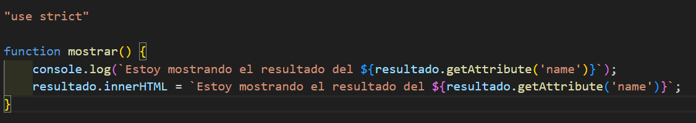
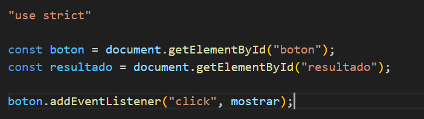
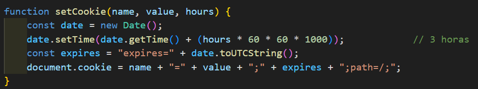
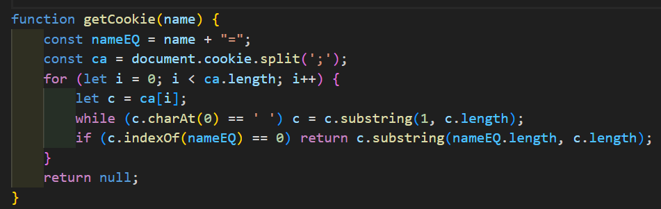
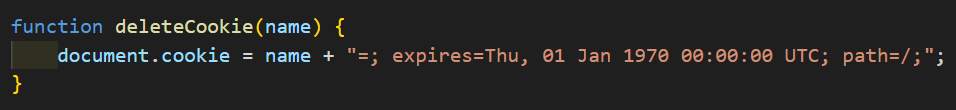
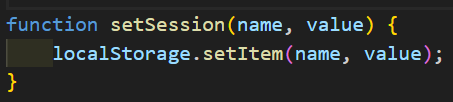
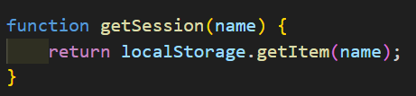
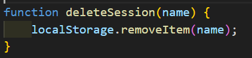
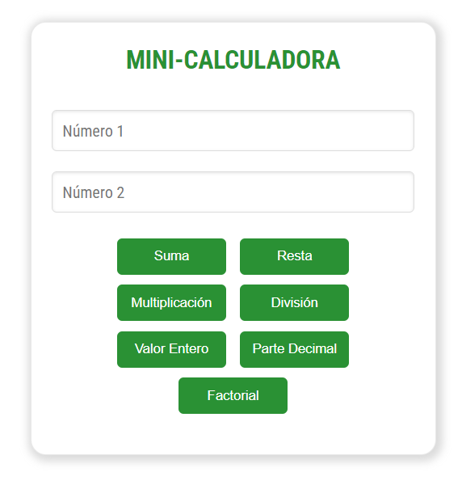
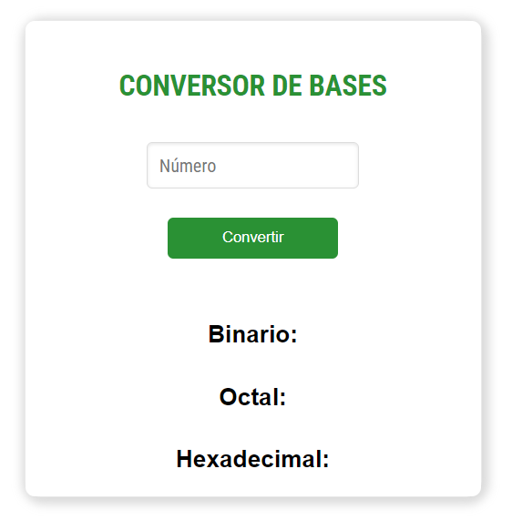

<h1>PortFolio JS ES6</h1>
<br>
<p>Trabajo realizado por Alba Romero con fines educativos</p>
<p>Proyecto de web realizado para la asignatura Desarrollo Web en Entorno Cliente</p>
<p>Septiembre de 2024</p>
<p>CopyRight ©</p>
<br>
<h2>Primera entrega</h2>
<p>Este proyecto es un portfolio de ejercicios de JavaScript. Muestra diferentes ejercicios, donde puedes ver más detalles de cada uno al hacer clic en un botón.</p>
<h4>Función.js</h4>
<p>Contiene la función "mostrar", que como su nombre indica, se encarga de mostrar un mensaje en la página y otro en la consola del navegador. Este último lo hace por medio de un <strong>Console.log</strong>.</p>
<p align="center">
  
</p>
<br>
<h4>Script.js</h4>
<p>Obtiene el botón y el área donde va a mostrarse el resultado. Al llamar al botón, se llama a la función mostrar mediante un <strong>EventListener.</strong></p>
<p align="center">
  
</p>
<a href="https://albaromero6.github.io/PortFolio-JS-ES6/PrimeraEntrega/index.html" target="_blank">
  
</a>
<br>
<h2>Segunda entrega</h2>
<p>Este código en JavaScript se activa al cargar la página y se encarga de autenticar a un usuario pidiéndole su nombre de usuario y contraseña. Al inicio, se definen algunas variables que guardan el nombre de usuario y la contraseña correctos, otra para almacenar lo que el usuario ingresa, y una <strong>flag</strong> que controla si este quiere intentarlo de nuevo. Dentro de un bucle, se le pide al usuario que escriba su nombre. Hay varias validaciones:</p>
<ul>
  <li>Si el usuario no escribe nada o cancela, se muestra un <strong>Alert</strong>.</li>
  <li>Si el nombre es demasiado corto, también se avisa con un <strong>Alert</strong>.</li>
  <li>Si el nombre no coincide con el que se tiene guardado, se dice que es incorrecto mediante otro <strong>Alert</strong>.</li>
  <li>Si algo no cuadra, se pregunta si quiere volver a intentarlo mediante un <strong>Confirm</strong>.</li>
  <li>Si el usuario indica que quiere cancelar, el script termina ahí y vuelve al inicio.</li>
  <li>Si el nombre de usuario es correcto, se le solicita que ingrese la contraseña mediante un <strong>Prompt</strong>.</li>
  <li>Si acierta con la contraseña, se le da la bienvenida con otro <strong>Alert</strong> y se muestra el contenido de la página.</li>
  <li>Si se equivoca, se muestra un mensaje de error y se pregunta si quiere intentarlo de nuevo.</li>
  <li>Si acepta, la página se recarga para comenzar de nuevo.</li>
</ul>
<br>

```javascript
"use strict";

window.onload = function() {

    let nombre_usuario_cargado = "Alba";
    let contrasena_cargada = "Romero";
    let nombre_usuario;
    let intentar_de_nuevo = true;

    while (intentar_de_nuevo) 
    {
        nombre_usuario = prompt("Introduzca su nombre de usuario", "Alba");

        if (nombre_usuario === null || nombre_usuario.trim() === "") {
            alert("Debe introducir un nombre de usuario");
        } else if (nombre_usuario.length < 3) {
            alert("El nombre de usuario debe tener al menos tres caracteres");
        } else if (nombre_usuario !== nombre_usuario_cargado) {
            alert("El nombre de usuario introducido es incorrecto");
        } else {
            break;
        }

        // Pregunta si quiere volver a intentarlo
        intentar_de_nuevo = confirm("¿Desea intentarlo de nuevo?");

        if (!intentar_de_nuevo) 
        {
            return; // Sale del bucle si elige "Cancelar"
        }
    }

    // Solo pide la contraseña si el nombre de usuario es correcto
    let contrasena = prompt("Ingrese su contraseña", "Romero");

    if (contrasena === contrasena_cargada) 
    {
        alert("¡Bienvenido!");
        document.getElementById("contenido").style.display = "flex";
    } 
    else 
    {
        alert("La contraseña introducida es incorrecta");
        let de_nuevo = confirm("¿Desea intentarlo de nuevo?");

        if (de_nuevo) 
        {
            location.reload();  // Recarga la página para intentar de nuevo
        }
    }
}
```

<br>
<a href="https://albaromero6.github.io/PortFolio-JS-ES6/SegundaEntrega/index.html" target="_blank">
  
</a>
<br>
<h2>Tercera entrega</h2>
<p>
Este código JavaScript se ejecuta cuando la página web se carga. Tiene un nombre de usuario y una contraseña guardados ("Alba" y "Romero"). Cuando el usuario envía el formulario de inicio de sesión, el código evita que la página se recargue y recoge los datos que el usuario escribió. Si el nombre de usuario y la contraseña son correctos, oculta el formulario y muestra otro contenido en la página. Si los datos son incorrectos, muestra un mensaje de error y permite que el usuario intente de nuevo. En pocas palabras, este código se encarga de verificar si el usuario puede acceder o no.</p>
<br>

```javascript
"use strict"

window.onload = function() {

    let nombre_usuario_cargado = "Alba";  
    let contrasena_cargada = "Romero";

    const formulario = document.getElementById("formulario_login");

    formulario.onsubmit = function(event) {

        event.preventDefault(); // Evitar que el formulario se envíe automáticamente

        let nombre_usuario = document.getElementById("nombreUsuario").value;        // Obtener usuario
        let contrasena_usuario = document.getElementById("passWordUsuario").value;  // Obtener contraseña

        // Verificar si el nombre y la contraseña coinciden con los valores cargados
        if (nombre_usuario === nombre_usuario_cargado && contrasena_usuario === contrasena_cargada) {
            formulario.style.display = "none";                               // Ocultar formulario 
            document.getElementById("contenido").style.display = "flex";     // Mostrar contenido
        } else {
            // Si los datos son incorrectos, mostrar el mensaje de error y permitir nuevos intentos
            document.getElementById("mensaje_error").style.display = "block"; // Mostrar mensaje de error si los datos son incorrectos
            formulario.querySelector('input[type="submit"]').disabled = false; // Asegurar que el botón no esté deshabilitado
        }
    };
};
````

<br>
<a href="https://albaromero6.github.io/PortFolio-JS-ES6/TerceraEntrega/index.html" target="_blank">
  
</a>
<br>
<h2>Cuarta entrega</h2>
<h3>Cookies</h3>
<hr>
<p>En esta entrega, en comparación con la anterior, he implementado varias funciones en JavaScript para que el sistema de inicio de sesión (Log In) que ya tenía creado pueda gestionar una sesión utilizando cookies y guardar datos con localStorage. De esta manera, la experiencia del usuario será mucho más cómoda al navegar por nuestra página. Algunas de las funciones que he utilizado son las siguientes:</p>
<br>
<h4>setCookie</h4>
<p align="center">
  
</p>
<p>La función setCookie(name, value, hours) se utiliza para crear o actualizar una cookie en una aplicación web. Le pasas el nombre de la cookie, el valor que quieres guardar y el tiempo en horas que debe permanecer activa. La función calcula una fecha de expiración y establece la cookie con el nombre y valor proporcionados. Esto permite recordar información importante, como preferencias del usuario o el estado de su sesión</p>
<br>
<h4>getCookie</h4>
<p align="center">
  
</p>
<p>Esta función se utiliza para recuperar el valor de una cookie en una aplicación web. Cuando llamas a esta, le pasas el nombre de la cookie que quieres encontrar. La función busca entre todas las cookies guardadas en el navegador. Primero, revisa cada cookie para ver si coincide con el nombre que proporcionaste. Si la encuentra, devuelve su valor. Si no la encuentra, devuelve null, que significa que la cookie no existe.</p>
<br>
<h4>deleteCookie</h4>
<p align="center">
  
</p>
<p>La función deleteCookie(name) se utiliza para eliminar una cookie en una aplicación web. Para hacerlo, establece la cookie con el nombre proporcionado y le asigna una fecha de expiración en el pasado. Esto indica al navegador que la cookie ya no es válida. Al usar esta función, puedes borrar información que ya no necesitas.</p>
<br>
<h4>setSession</h4>
<p align="center">
  
</p>
<p>La función setSession(name, value) se utiliza para guardar datos en el almacenamiento local del navegador. Le pasas un nombre para identificar el dato y un valor que deseas almacenar. Al usar esta función, puedes recordar información importante entre visitas del usuario, ya que los datos se mantendrán disponibles incluso si el navegador se cierra.</p>
<br>
<h4>getSession</h4>
<p align="center">
  
</p>
<p>La función getSession(name) se utiliza para recuperar datos del almacenamiento local del navegador. Al llamar a esta función, le pasas el nombre del dato que quieres obtener. Si el dato existe, la función devuelve su valor; si no, devuelve null. Esto te permite acceder a información previamente almacenada.</p>
<br>
<h4>deleteSession</h4>
<p align="center">
  
</p>
<p>La función deleteSession(name) se utiliza para eliminar un dato del almacenamiento local del navegador. Al llamar a esta función, le pasas el nombre del dato que deseas borrar. Esto permite limpiar la información almacenada.</p>
<br>
<h4>Lógica del código</h4>
<p>El código se ejecuta cuando el contenido del documento HTML se ha cargado completamente, para eso usamos defer. Primero, se define un usuario y una contraseña. Luego, verificamos si el usuario ya ha iniciado sesión, ya sea mediante una cookie o el almacenamiento local. Dependiendo del resultado, muestra u oculta el formulario de inicio de sesión, el contenido de la página y un botón para cerrar sesión. Cuando se envía el formulario, evita el envío automático y comprueba si los datos introducidos coinciden con las credenciales predeterminadas. Si son correctos, oculta el formulario, muestra el contenido y establece una cookie y una sesión para el usuario. Si son incorrectos, muestra un mensaje de error.Finalmente, permite cerrar la sesión al hacer clic en el botón correspondiente, eliminando la cookie y la sesión, notificando al usuario y redirigiéndolo a la página de inicio.</p>
<br>
<h3>Number</h3>
<hr>
Además, para la sección de números, he añadido una opción desplegable en la barra de navegación que, al pasar el ratón sobre ella, muestra dos opciones: "Minicalculadora" y "Conversor de bases".
<br>
<h4>Minicalculadora</h4>
<p align="center">
  
</p>
<p>Se define una variable global llamada resultado, que se inicializa en 0 y se utiliza para almacenar el resultado de las operaciones matemáticas. La función suma() obtiene dos números de los campos de entrada, los suma y actualiza resultado. Luego, llama a la función mostrarResultado() para mostrar el resultado. La función resta() también obtiene los números de los campos de entrada, realiza la resta y actualiza resultado, mostrando el resultado. La función multiplicacion() multiplica los dos números ingresados y actualiza resultado, mostrando el resultado. La función division() comprueba que el segundo número no sea cero antes de dividir, para evitar errores. Si es cero, muestra un mensaje de alerta. Si no, realiza la división y actualiza el resultado. La función valorEntero() redondea el resultado hacia abajo usando Math.floor() y lo muestra. La función parteDecimal() calcula y guarda solo la parte decimal del resultado, mostrando el resultado actualizado. La función factorial() calcula el factorial de un número ingresado. Si el número es negativo, muestra un mensaje de alerta, ya que el factorial no está definido para números negativos. La función mostrarResultado() actualiza el contenido de un elemento HTML con el ID "result" para mostrar el resultado de la operación actual.</p>
<br>

```javascript
"use strict"

let resultado = 0; // Variable para guardar el resultado 

function suma() {
    const op1 = parseFloat(document.getElementById("op1").value); 
    const op2 = parseFloat(document.getElementById("op2").value); 
    resultado = op1 + op2; 
    mostrarResultado(); 
}

function resta() {
    const op1 = parseFloat(document.getElementById("op1").value); 
    const op2 = parseFloat(document.getElementById("op2").value); 
    resultado = op1 - op2; 
    mostrarResultado(); 
}

function multiplicacion() {
    const op1 = parseFloat(document.getElementById("op1").value); 
    const op2 = parseFloat(document.getElementById("op2").value); 
    resultado = op1 * op2; 
    mostrarResultado(); 
}

function division() {
    const op1 = parseFloat(document.getElementById("op1").value); 
    const op2 = parseFloat(document.getElementById("op2").value); 

    if (op2 !== 0) { // Comprobar que el segundo operando no sea cero
        resultado = op1 / op2; 
        mostrarResultado(); 
    } else {
        alert("No se puede dividir entre cero"); 
    }
}

function valorEntero() {
    resultado = Math.floor(resultado); // Redondear hacia abajo el resultado
    mostrarResultado(); 
}

function parteDecimal() {
    const parteDecimal = resultado - Math.floor(resultado); // Calcular la parte decimal
    resultado = parteDecimal; 
    mostrarResultado(); 
}

function factorial() {
    const op1 = parseInt(document.getElementById("op1").value); // Obtener el primer operando y convertirlo a entero
    if (op1 < 0) { // Comprobar si el número es negativo
        alert("El factorial no existe para números negativos"); 
        return; 
    }
    resultado = 1; 
    for (let i = 1; i <= op1; i++) { 
        resultado *= i; 
    }
    mostrarResultado(); 
}

function mostrarResultado() {
    document.getElementById("result").innerText = resultado; 
}
```

<h4>Conversor de bases</h4>
<p align="center">
  
</p>
<p>La función convertir() se encarga de convertir un número ingresado por el usuario en diferentes bases numéricas: binaria, octal y hexadecimal. Primero, obtiene el valor de un campo de entrada HTML con el ID "num1" y lo convierte a un número entero usando parseInt(). Luego, verifica si el valor ingresado es un número válido; si no lo es, muestra una alerta solicitando un número correcto y termina la ejecución de la función. Si el número es válido, procede a realizar las conversiones: utiliza toString(2) para obtener la representación binaria, toString(8) para la representación octal y toString(16).toUpperCase() para la representación hexadecimal, asegurándose de que el resultado esté en mayúsculas. Finalmente, muestra los resultados de las conversiones en elementos HTML con los IDs "resultadoBinario", "resultadoOctal" y "resultadoHexadecimal", actualizando el texto de estos elementos para reflejar los valores convertidos.</p>
<br>

```javascript
"use strict";

function convertir() {

    const num = parseInt(document.getElementById("num1").value); // Obtener el número
    if (isNaN(num)) {
        alert("Por favor, ingresa un número válido.");
        return;
    }

    // Convertir a las distintas bases
    const binario = num.toString(2);
    const octal = num.toString(8); 
    const hexadecimal = num.toString(16).toUpperCase();

    // Mostrar resultados
    document.getElementById("resultadoBinario").innerText = "Binario: " + binario;
    document.getElementById("resultadoOctal").innerText = "Octal: " + octal;
    document.getElementById("resultadoHexadecimal").innerText = "Hexadecimal: " + hexadecimal;
}
```
<br>
<a href="https://albaromero6.github.io/PortFolio-JS-ES6/CuartaEntrega/index.html" target="_blank">
  
</a>
<br>
<h2>Quinta entrega</h2>
<h3>LocalStorage</h3>
<hr>
<p>Como en la anterior entrega implementé tanto el uso de <strong>Cookies</strong> como el uso de <strong>LocalStorage</strong>, en esta he optado por implementar solo este último. Este código es un script en JavaScript que maneja un sistema de inicio y cierre de sesión usando localStorage. Al cargar la página, verifica si hay un usuario almacenado. Si hay uno, oculta el formulario de inicio de sesión y muestra el contenido de la página junto con un botón para cerrar la sesión. Si no hay un usuario, se muestra el formulario. Cuando un usuario intenta iniciar sesión, compara los datos ingresados con un nombre de usuario y contraseña predefinidos. Si coinciden, guarda el nombre de usuario en localStorage y muestra el contenido de la página; si no, muestra un mensaje de error. Al hacer clic en el botón de cerrar sesión, se elimina el nombre de usuario de localStorage y se redirige al usuario a la página de inicio.</p>

```javascript
"use strict";

// Funciones para manejar localStorage

function setSession(name, value) {
    localStorage.setItem(name, value);
}

function getSession(name) {
    return localStorage.getItem(name);
}

function deleteSession(name) {
    localStorage.removeItem(name);
}

document.addEventListener("DOMContentLoaded", function () {

    let nombre_usuario_cargado = "Alba"; 
    let contrasena_cargada = "Romero"; 

    const formulario = document.getElementById("formulario_login");
    const boton_cerrar = document.getElementById("boton_cerrar");
    const contenido = document.getElementById("contenido");
    const dropdown = document.querySelectorAll(".dropdown"); 

    // Verificar si el usuario ya ha iniciado sesión en localStorage

    const usuario = getSession("username");

    if (usuario) {
        formulario.style.display = "none";            // Ocultar el formulario si hay sesión
        contenido.style.display = "flex";             // Mostrar el contenido si hay sesión
        boton_cerrar.style.display = "flex";          // Mostrar el botón de cerrar sesión
        dropdown.forEach(dropdown => {
            dropdown.style.display = "inline-block";  // Mostrar todos los menús desplegables      
        });

    } else {
        formulario.style.display = "block";           // Mostrar el formulario si no hay sesión
        contenido.style.display = "none";             // Ocultar el contenido si no hay sesión
        boton_cerrar.style.display = "none";          // Ocultar el botón de cerrar sesión
        dropdown.forEach(dropdown => {
            dropdown.style.display = "none";          // Ocultar todos los menús desplegables
        });
    }

    formulario.onsubmit = function (event) {
        event.preventDefault();                       // Evitar que el formulario se envíe automáticamente

        let nombre_usuario = document.getElementById("nombreUsuario").value;
        let contrasena_usuario = document.getElementById("passWordUsuario").value;

        if (nombre_usuario === nombre_usuario_cargado && contrasena_usuario === contrasena_cargada) {

            formulario.style.display = "none";            // Ocultar el formulario si los datos son correctos
            contenido.style.display = "flex";             // Mostrar el contenido si los datos son correctos
            boton_cerrar.style.display = "flex";          // Mostrar el botón de cerrar sesión
            dropdown.forEach(dropdown => {
                dropdown.style.display = "inline-block";  // Mostrar todos los menús desplegables      
            });
            
            setSession("username", nombre_usuario);       // Guardar la sesión en localStorage

        } else {
            document.getElementById("mensaje_error").style.display = "block"; // Mostrar error si los datos no son correctos
        }
    };

    // Manejo del cierre de sesión
    boton_cerrar.onclick = function () {
        cerrarSesion();
    };

    function cerrarSesion() {
        deleteSession("username");                      // Eliminar la sesión de localStorage
        alert("Sesión cerrada");                        // Avisar al usuario que se cerró la sesión
        window.location.href = "index.html";            // Redirigir al inicio después de cerrar sesión
    }
});

```
<br>
<h3><strong>String</strong></h3>
<hr>
Además, para la sección de números, he añadido una opción desplegable en la barra de navegación que, al pasar el ratón sobre ella, muestra dos opciones: "Minicalculadora" y "Conversor de bases".
<br>
<h4>Minicalculadora</h4>
<p align="center">
  
</p>
<p>Se define una variable global llamada resultado, que se inicializa en 0 y se utiliza para almacenar el resultado de las operaciones matemáticas. La función suma() obtiene dos números de los campos de entrada, los suma y actualiza resultado. Luego, llama a la función mostrarResultado() para mostrar el resultado. La función resta() también obtiene los números de los campos de entrada, realiza la resta y actualiza resultado, mostrando el resultado. La función multiplicacion() multiplica los dos números ingresados y actualiza resultado, mostrando el resultado. La función division() comprueba que el segundo número no sea cero antes de dividir, para evitar errores. Si es cero, muestra un mensaje de alerta. Si no, realiza la división y actualiza el resultado. La función valorEntero() redondea el resultado hacia abajo usando Math.floor() y lo muestra. La función parteDecimal() calcula y guarda solo la parte decimal del resultado, mostrando el resultado actualizado. La función factorial() calcula el factorial de un número ingresado. Si el número es negativo, muestra un mensaje de alerta, ya que el factorial no está definido para números negativos. La función mostrarResultado() actualiza el contenido de un elemento HTML con el ID "result" para mostrar el resultado de la operación actual.</p>
<br>
