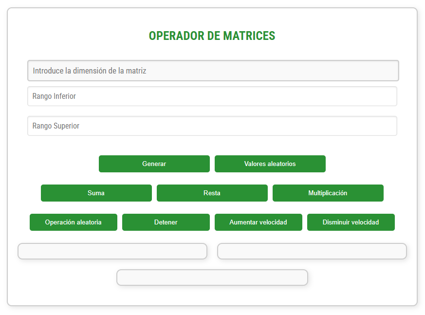

<h1>PortFolio JS ES6</h1>
<br>
<p>Trabajo realizado por Alba Romero con fines educativos</p>
<p>Proyecto de web realizado para la asignatura Desarrollo Web en Entorno Cliente</p>
<p>Septiembre de 2024</p>
<p>CopyRight ©</p>
<br>
<h2>Primera entrega</h2>
<p>Este proyecto es un portfolio de ejercicios de JavaScript. Muestra diferentes ejercicios, donde puedes ver más detalles de cada uno al hacer clic en un botón.</p>
<h4>Función.js</h4>
<p>Contiene la función "mostrar", que como su nombre indica, se encarga de mostrar un mensaje en la página y otro en la consola del navegador. Este último lo hace por medio de un <strong>Console.log</strong>.</p>
<p align="center">
  
</p>
<br>
<h4>Script.js</h4>
<p>Obtiene el botón y el área donde va a mostrarse el resultado. Al llamar al botón, se llama a la función mostrar mediante un <strong>EventListener.</strong></p>
<p align="center">
  
</p>
<a href="https://albaromero6.github.io/PortFolio-JS-ES6/PrimeraEntrega/index.html" target="_blank">
  
</a>
<br>
<h2>Segunda entrega</h2>
<p>Este código en JavaScript se activa al cargar la página y se encarga de autenticar a un usuario pidiéndole su nombre de usuario y contraseña. Al inicio, se definen algunas variables que guardan el nombre de usuario y la contraseña correctos, otra para almacenar lo que el usuario ingresa, y una <strong>flag</strong> que controla si este quiere intentarlo de nuevo. Dentro de un bucle, se le pide al usuario que escriba su nombre. Hay varias validaciones:</p>
<ul>
  <li>Si el usuario no escribe nada o cancela, se muestra un <strong>Alert</strong>.</li>
  <li>Si el nombre es demasiado corto, también se avisa con un <strong>Alert</strong>.</li>
  <li>Si el nombre no coincide con el que se tiene guardado, se dice que es incorrecto mediante otro <strong>Alert</strong>.</li>
  <li>Si algo no cuadra, se pregunta si quiere volver a intentarlo mediante un <strong>Confirm</strong>.</li>
  <li>Si el usuario indica que quiere cancelar, el script termina ahí y vuelve al inicio.</li>
  <li>Si el nombre de usuario es correcto, se le solicita que ingrese la contraseña mediante un <strong>Prompt</strong>.</li>
  <li>Si acierta con la contraseña, se le da la bienvenida con otro <strong>Alert</strong> y se muestra el contenido de la página.</li>
  <li>Si se equivoca, se muestra un mensaje de error y se pregunta si quiere intentarlo de nuevo.</li>
  <li>Si acepta, la página se recarga para comenzar de nuevo.</li>
</ul>
<br>

```javascript
"use strict";

window.onload = function() {

    let nombre_usuario_cargado = "Alba";
    let contrasena_cargada = "Romero";
    let nombre_usuario;
    let intentar_de_nuevo = true;

    while (intentar_de_nuevo) 
    {
        nombre_usuario = prompt("Introduzca su nombre de usuario", "Alba");

        if (nombre_usuario === null || nombre_usuario.trim() === "") {
            alert("Debe introducir un nombre de usuario");
        } else if (nombre_usuario.length < 3) {
            alert("El nombre de usuario debe tener al menos tres caracteres");
        } else if (nombre_usuario !== nombre_usuario_cargado) {
            alert("El nombre de usuario introducido es incorrecto");
        } else {
            break;
        }

        // Pregunta si quiere volver a intentarlo
        intentar_de_nuevo = confirm("¿Desea intentarlo de nuevo?");

        if (!intentar_de_nuevo) 
        {
            return; // Sale del bucle si elige "Cancelar"
        }
    }

    // Solo pide la contraseña si el nombre de usuario es correcto
    let contrasena = prompt("Ingrese su contraseña", "Romero");

    if (contrasena === contrasena_cargada) 
    {
        alert("¡Bienvenido!");
        document.getElementById("contenido").style.display = "flex";
    } 
    else 
    {
        alert("La contraseña introducida es incorrecta");
        let de_nuevo = confirm("¿Desea intentarlo de nuevo?");

        if (de_nuevo) 
        {
            location.reload();  // Recarga la página para intentar de nuevo
        }
    }
}
```

<br>
<a href="https://albaromero6.github.io/PortFolio-JS-ES6/SegundaEntrega/index.html" target="_blank">
  
</a>
<br>
<h2>Tercera entrega</h2>
<p>
Este código JavaScript se ejecuta cuando la página web se carga. Tiene un nombre de usuario y una contraseña guardados ("Alba" y "Romero"). Cuando el usuario envía el formulario de inicio de sesión, el código evita que la página se recargue y recoge los datos que el usuario escribió. Si el nombre de usuario y la contraseña son correctos, oculta el formulario y muestra otro contenido en la página. Si los datos son incorrectos, muestra un mensaje de error y permite que el usuario intente de nuevo. En pocas palabras, este código se encarga de verificar si el usuario puede acceder o no.</p>
<br>

```javascript
"use strict"

window.onload = function() {

    let nombre_usuario_cargado = "Alba";  
    let contrasena_cargada = "Romero";

    const formulario = document.getElementById("formulario_login");

    formulario.onsubmit = function(event) {

        event.preventDefault(); // Evitar que el formulario se envíe automáticamente

        let nombre_usuario = document.getElementById("nombreUsuario").value;        // Obtener usuario
        let contrasena_usuario = document.getElementById("passWordUsuario").value;  // Obtener contraseña

        // Verificar si el nombre y la contraseña coinciden con los valores cargados
        if (nombre_usuario === nombre_usuario_cargado && contrasena_usuario === contrasena_cargada) {
            formulario.style.display = "none";                               // Ocultar formulario 
            document.getElementById("contenido").style.display = "flex";     // Mostrar contenido
        } else {
            // Si los datos son incorrectos, mostrar el mensaje de error y permitir nuevos intentos
            document.getElementById("mensaje_error").style.display = "block"; // Mostrar mensaje de error si los datos son incorrectos
            formulario.querySelector('input[type="submit"]').disabled = false; // Asegurar que el botón no esté deshabilitado
        }
    };
};
````

<br>
<a href="https://albaromero6.github.io/PortFolio-JS-ES6/TerceraEntrega/index.html" target="_blank">
  
</a>
<br>
<h2>Cuarta entrega</h2>
<h3>Cookies</h3>
<hr>
<p>En esta entrega, en comparación con la anterior, he implementado varias funciones en JavaScript para que el sistema de inicio de sesión (Log In) que ya tenía creado pueda gestionar una sesión utilizando cookies y guardar datos con localStorage. De esta manera, la experiencia del usuario será mucho más cómoda al navegar por nuestra página. Algunas de las funciones que he utilizado son las siguientes:</p>
<br>
<h4>setCookie</h4>
<p align="center">
  
</p>
<p>La función setCookie(name, value, hours) se utiliza para crear o actualizar una cookie en una aplicación web. Le pasas el nombre de la cookie, el valor que quieres guardar y el tiempo en horas que debe permanecer activa. La función calcula una fecha de expiración y establece la cookie con el nombre y valor proporcionados. Esto permite recordar información importante, como preferencias del usuario o el estado de su sesión</p>
<br>
<h4>getCookie</h4>
<p align="center">
  
</p>
<p>Esta función se utiliza para recuperar el valor de una cookie en una aplicación web. Cuando llamas a esta, le pasas el nombre de la cookie que quieres encontrar. La función busca entre todas las cookies guardadas en el navegador. Primero, revisa cada cookie para ver si coincide con el nombre que proporcionaste. Si la encuentra, devuelve su valor. Si no la encuentra, devuelve null, que significa que la cookie no existe.</p>
<br>
<h4>deleteCookie</h4>
<p align="center">
  
</p>
<p>La función deleteCookie(name) se utiliza para eliminar una cookie en una aplicación web. Para hacerlo, establece la cookie con el nombre proporcionado y le asigna una fecha de expiración en el pasado. Esto indica al navegador que la cookie ya no es válida. Al usar esta función, puedes borrar información que ya no necesitas.</p>
<br>
<h4>setSession</h4>
<p align="center">
  
</p>
<p>La función setSession(name, value) se utiliza para guardar datos en el almacenamiento local del navegador. Le pasas un nombre para identificar el dato y un valor que deseas almacenar. Al usar esta función, puedes recordar información importante entre visitas del usuario, ya que los datos se mantendrán disponibles incluso si el navegador se cierra.</p>
<br>
<h4>getSession</h4>
<p align="center">
  
</p>
<p>La función getSession(name) se utiliza para recuperar datos del almacenamiento local del navegador. Al llamar a esta función, le pasas el nombre del dato que quieres obtener. Si el dato existe, la función devuelve su valor; si no, devuelve null. Esto te permite acceder a información previamente almacenada.</p>
<br>
<h4>deleteSession</h4>
<p align="center">
  
</p>
<p>La función deleteSession(name) se utiliza para eliminar un dato del almacenamiento local del navegador. Al llamar a esta función, le pasas el nombre del dato que deseas borrar. Esto permite limpiar la información almacenada.</p>
<br>
<h4>Lógica del código</h4>
<p>El código se ejecuta cuando el contenido del documento HTML se ha cargado completamente, para eso usamos defer. Primero, se define un usuario y una contraseña. Luego, verificamos si el usuario ya ha iniciado sesión, ya sea mediante una cookie o el almacenamiento local. Dependiendo del resultado, muestra u oculta el formulario de inicio de sesión, el contenido de la página y un botón para cerrar sesión. Cuando se envía el formulario, evita el envío automático y comprueba si los datos introducidos coinciden con las credenciales predeterminadas. Si son correctos, oculta el formulario, muestra el contenido y establece una cookie y una sesión para el usuario. Si son incorrectos, muestra un mensaje de error.Finalmente, permite cerrar la sesión al hacer clic en el botón correspondiente, eliminando la cookie y la sesión, notificando al usuario y redirigiéndolo a la página de inicio.</p>
<br>
<h3>Number</h3>
<hr>
Además, para la sección de números, he añadido una opción desplegable en la barra de navegación que, al pasar el ratón sobre ella, muestra dos opciones: "Minicalculadora" y "Conversor de bases".
<br>
<h4>Minicalculadora</h4>
<p align="center">
  
</p>
<p>Se define una variable global llamada resultado, que se inicializa en 0 y se utiliza para almacenar el resultado de las operaciones matemáticas. La función suma() obtiene dos números de los campos de entrada, los suma y actualiza resultado. Luego, llama a la función mostrarResultado() para mostrar el resultado. La función resta() también obtiene los números de los campos de entrada, realiza la resta y actualiza resultado, mostrando el resultado. La función multiplicacion() multiplica los dos números ingresados y actualiza resultado, mostrando el resultado. La función division() comprueba que el segundo número no sea cero antes de dividir, para evitar errores. Si es cero, muestra un mensaje de alerta. Si no, realiza la división y actualiza el resultado. La función valorEntero() redondea el resultado hacia abajo usando Math.floor() y lo muestra. La función parteDecimal() calcula y guarda solo la parte decimal del resultado, mostrando el resultado actualizado. La función factorial() calcula el factorial de un número ingresado. Si el número es negativo, muestra un mensaje de alerta, ya que el factorial no está definido para números negativos. La función mostrarResultado() actualiza el contenido de un elemento HTML con el ID "result" para mostrar el resultado de la operación actual.</p>
<br>

```javascript
"use strict"

let resultado = 0; // Variable para guardar el resultado 

function suma() {
    const op1 = parseFloat(document.getElementById("op1").value); 
    const op2 = parseFloat(document.getElementById("op2").value); 
    resultado = op1 + op2; 
    mostrarResultado(); 
}

function resta() {
    const op1 = parseFloat(document.getElementById("op1").value); 
    const op2 = parseFloat(document.getElementById("op2").value); 
    resultado = op1 - op2; 
    mostrarResultado(); 
}

function multiplicacion() {
    const op1 = parseFloat(document.getElementById("op1").value); 
    const op2 = parseFloat(document.getElementById("op2").value); 
    resultado = op1 * op2; 
    mostrarResultado(); 
}

function division() {
    const op1 = parseFloat(document.getElementById("op1").value); 
    const op2 = parseFloat(document.getElementById("op2").value); 

    if (op2 !== 0) { // Comprobar que el segundo operando no sea cero
        resultado = op1 / op2; 
        mostrarResultado(); 
    } else {
        alert("No se puede dividir entre cero"); 
    }
}

function valorEntero() {
    resultado = Math.floor(resultado); // Redondear hacia abajo el resultado
    mostrarResultado(); 
}

function parteDecimal() {
    const parteDecimal = resultado - Math.floor(resultado); // Calcular la parte decimal
    resultado = parteDecimal; 
    mostrarResultado(); 
}

function factorial() {
    const op1 = parseInt(document.getElementById("op1").value); // Obtener el primer operando y convertirlo a entero
    if (op1 < 0) { // Comprobar si el número es negativo
        alert("El factorial no existe para números negativos"); 
        return; 
    }
    resultado = 1; 
    for (let i = 1; i <= op1; i++) { 
        resultado *= i; 
    }
    mostrarResultado(); 
}

function mostrarResultado() {
    document.getElementById("result").innerText = resultado; 
}
```

<h4>Conversor de bases</h4>
<p align="center">
  
</p>
<p>La función convertir() se encarga de convertir un número ingresado por el usuario en diferentes bases numéricas: binaria, octal y hexadecimal. Primero, obtiene el valor de un campo de entrada HTML con el ID "num1" y lo convierte a un número entero usando parseInt(). Luego, verifica si el valor ingresado es un número válido; si no lo es, muestra una alerta solicitando un número correcto y termina la ejecución de la función. Si el número es válido, procede a realizar las conversiones: utiliza toString(2) para obtener la representación binaria, toString(8) para la representación octal y toString(16).toUpperCase() para la representación hexadecimal, asegurándose de que el resultado esté en mayúsculas. Finalmente, muestra los resultados de las conversiones en elementos HTML con los IDs "resultadoBinario", "resultadoOctal" y "resultadoHexadecimal", actualizando el texto de estos elementos para reflejar los valores convertidos.</p>
<br>

```javascript
"use strict";

function convertir() {

    const num = parseInt(document.getElementById("num1").value); // Obtener el número
    if (isNaN(num)) {
        alert("Por favor, ingresa un número válido.");
        return;
    }

    // Convertir a las distintas bases
    const binario = num.toString(2);
    const octal = num.toString(8); 
    const hexadecimal = num.toString(16).toUpperCase();

    // Mostrar resultados
    document.getElementById("resultadoBinario").innerText = "Binario: " + binario;
    document.getElementById("resultadoOctal").innerText = "Octal: " + octal;
    document.getElementById("resultadoHexadecimal").innerText = "Hexadecimal: " + hexadecimal;
}
```
<br>
<a href="https://albaromero6.github.io/PortFolio-JS-ES6/CuartaEntrega/index.html" target="_blank">
  
</a>
<br>
<h2>Quinta entrega</h2>
<h3>LocalStorage</h3>
<hr>
<p>Como en la anterior entrega implementé tanto el uso de <strong>Cookies</strong> como el uso de <strong>LocalStorage</strong>, en esta he optado por implementar solo este último. Este código es un script en JavaScript que maneja un sistema de inicio y cierre de sesión usando localStorage. Al cargar la página, verifica si hay un usuario almacenado. Si hay uno, oculta el formulario de inicio de sesión y muestra el contenido de la página junto con un botón para cerrar la sesión. Si no hay un usuario, se muestra el formulario. Cuando un usuario intenta iniciar sesión, compara los datos ingresados con un nombre de usuario y contraseña predefinidos. Si coinciden, guarda el nombre de usuario en localStorage y muestra el contenido de la página; si no, muestra un mensaje de error. Al hacer clic en el botón de cerrar sesión, se elimina el nombre de usuario de localStorage y se redirige al usuario a la página de inicio.</p>

```javascript
"use strict";

// Funciones para manejar localStorage

function setSession(name, value) {
    localStorage.setItem(name, value);
}

function getSession(name) {
    return localStorage.getItem(name);
}

function deleteSession(name) {
    localStorage.removeItem(name);
}

document.addEventListener("DOMContentLoaded", function () {

    let nombre_usuario_cargado = "Alba"; 
    let contrasena_cargada = "Romero"; 

    const formulario = document.getElementById("formulario_login");
    const boton_cerrar = document.getElementById("boton_cerrar");
    const contenido = document.getElementById("contenido");
    const dropdown = document.querySelectorAll(".dropdown"); 

    // Verificar si el usuario ya ha iniciado sesión en localStorage

    const usuario = getSession("username");

    if (usuario) {
        formulario.style.display = "none";            // Ocultar el formulario si hay sesión
        contenido.style.display = "flex";             // Mostrar el contenido si hay sesión
        boton_cerrar.style.display = "flex";          // Mostrar el botón de cerrar sesión
        dropdown.forEach(dropdown => {
            dropdown.style.display = "inline-block";  // Mostrar todos los menús desplegables      
        });

    } else {
        formulario.style.display = "block";           // Mostrar el formulario si no hay sesión
        contenido.style.display = "none";             // Ocultar el contenido si no hay sesión
        boton_cerrar.style.display = "none";          // Ocultar el botón de cerrar sesión
        dropdown.forEach(dropdown => {
            dropdown.style.display = "none";          // Ocultar todos los menús desplegables
        });
    }

    formulario.onsubmit = function (event) {
        event.preventDefault();                       // Evitar que el formulario se envíe automáticamente

        let nombre_usuario = document.getElementById("nombreUsuario").value;
        let contrasena_usuario = document.getElementById("passWordUsuario").value;

        if (nombre_usuario === nombre_usuario_cargado && contrasena_usuario === contrasena_cargada) {

            formulario.style.display = "none";            // Ocultar el formulario si los datos son correctos
            contenido.style.display = "flex";             // Mostrar el contenido si los datos son correctos
            boton_cerrar.style.display = "flex";          // Mostrar el botón de cerrar sesión
            dropdown.forEach(dropdown => {
                dropdown.style.display = "inline-block";  // Mostrar todos los menús desplegables      
            });
            
            setSession("username", nombre_usuario);       // Guardar la sesión en localStorage

        } else {
            document.getElementById("mensaje_error").style.display = "block"; // Mostrar error si los datos no son correctos
        }
    };

    // Manejo del cierre de sesión
    boton_cerrar.onclick = function () {
        cerrarSesion();
    };

    function cerrarSesion() {
        deleteSession("username");                      // Eliminar la sesión de localStorage
        alert("Sesión cerrada");                        // Avisar al usuario que se cerró la sesión
        window.location.href = "index.html";            // Redirigir al inicio después de cerrar sesión
    }
});

```
<br>
<h3>String</h3>
<hr>
Además, para la sección de cadenas, he añadido una opción desplegable en la barra de navegación que, al pasar el ratón sobre ella, muestra dos opciones: "Modificador de texto" y "Modificador de texto con API".
<br>
<h4>Modificador de texto</h4>
<p align="center">
  
<br> 
<p>La función <strong>toUpperCase</strong> recibe un texto como entrada y lo convierte a mayúsculas. Luego, devuelve el texto transformado.</p>

```javascript
// Función para convertir todo el texto a mayúsculas
function toUpperCase(text) {
    return text.toUpperCase();
}

```
<br>
<p>La función <strong>toLowerCase</strong> toma un texto como entrada y lo convierte a minúsculas. Luego, devuelve el texto en este nuevo formato.</p>

```javascript
// Función para convertir todo el texto a minúsculas
function toLowerCase(text) {
    return text.toLowerCase();
}

```
<br>
<p>La función <strong>uppercaseFirstLetter</strong> toma un texto como entrada y convierte la primera letra de cada palabra en mayúscula. Primero, divide el texto en palabras usando el espacio como separador mediante la función <strong>split</strong>. Luego, recorre cada palabra, cambia la primera letra a mayúscula y mantiene el resto de la palabra sin cambios. Finalmente, une todas las palabras de nuevo en un solo texto y lo devuelve.</p>

```javascript
// Función para poner en mayúsculas la primera letra de cada palabra
function uppercaseFirstLetter(text) {
    let words = text.split(' ');
    for (let i = 0; i < words.length; i++) {
        words[i] = words[i].charAt(0).toUpperCase() + words[i].slice(1);
    }
    return words.join(' ');
}

```

<br>
<p>La función <strong>uppercaseLastLetter</strong> recibe un texto y convierte la última letra de cada palabra en mayúscula. Primero, separa el texto en palabras usando espacios. Luego, recorre cada palabra y toma todos los caracteres excepto el último, y añade la última letra convertida a mayúscula. Finalmente, une todas las palabras de nuevo en un solo texto y lo devuelve.</p>

```javascript
// Función para poner en mayúsculas la última letra de cada palabra
function uppercaseLastLetter(text) {
    let words = text.split(' ');
    for (let i = 0; i < words.length; i++) {
        words[i] = words[i].slice(0, -1) + words[i].charAt(words[i].length - 1).toUpperCase();
    }
    return words.join(' ');
}

```

<br>
<p>La función <strong>lowercaseFirstLetter</strong> toma un texto como entrada y convierte la primera letra de cada palabra en minúscula. Primero, divide el texto en palabras usando el espacio como separador. Luego, recorre cada palabra, cambia la primera letra a minúscula y mantiene el resto de la palabra sin cambios. Finalmente, une todas las palabras de nuevo en un solo texto y lo devuelve.</p>

```javascript
// Función para poner en minúscula la primera letra de cada palabra
function lowercaseFirstLetter(text) {
    let words = text.split(' ');
    for (let i = 0; i < words.length; i++) {
        words[i] = words[i].charAt(0).toLowerCase() + words[i].slice(1);
    }
    return words.join(' ');
}

```

<br>
<p>La función <strong>lowercaseLastLetter</strong> recibe un texto y convierte la última letra de cada palabra en minúscula. Primero, separa el texto en palabras utilizando los espacios como separadores. Luego, recorre cada palabra, toma todos los caracteres excepto el último y añade la última letra convertida a minúscula. Finalmente, une todas las palabras nuevamente en un solo texto y lo devuelve.</p>

```javascript
// Función para poner en minúscula la última letra de cada palabra
function lowercaseLastLetter(text) {
    let words = text.split(' ');
    for (let i = 0; i < words.length; i++) {
        words[i] = words[i].slice(0, -1) + words[i].charAt(words[i].length - 1).toLowerCase();
    }
    return words.join(' ');
}

```

<br>
<p>La función <strong>uppercaseVowels</strong> toma un texto como entrada y convierte todas las vocales en mayúsculas. Utiliza el método <strong>replace</strong> con una expresión regular que busca todas las vocales en el texto. Cada vez que encuentra una vocal, la función la reemplaza por su versión en mayúscula. Al final, devuelve el texto modificado.</p>

```javascript
// Función para poner todas las vocales en mayúsculas
function uppercaseVowels(text) {
    return text.replace(/[aeiou]/g, function(match) {
        return match.toUpperCase();
    });
}

```

<br>
<p>La función <strong>lowercaseVowels</strong> toma un texto como entrada y convierte todas las vocales mayúsculas, en minúsculas. Utiliza el método <strong>replace</strong> junto con una expresión regular que busca estas vocales en el texto. Cada vez que encuentra una vocal mayúscula, la reemplaza por su versión en minúscula. Al final, devuelve el texto modificado.</p>

```javascript
// Función para poner todas las vocales en minúsculas
function lowercaseVowels(text) {
    return text.replace(/[AEIOU]/g, function(match) {
        return match.toLowerCase();
    });
}

```

<br>
<p>La función <strong>uppercaseConsonants</strong> toma un texto como entrada y convierte todas las consonantes en mayúsculas. Utiliza el método <strong>replace</strong> con una expresión regular que busca estas consonantes en el texto. Cada vez que encuentra una consonante, la reemplaza por su versión en mayúscula. Finalmente, devuelve el texto modificado.</p>

```javascript
// Función para poner todas las consonantes en mayúsculas
function uppercaseConsonants(text) {
    return text.replace(/[bcdfghjklmnpqrstvwxyz]/g, function(match) {
        return match.toUpperCase();
    });
}

```

<br>
<p>La función <strong>lowercaseConsonants</strong> recibe un texto y convierte todas las consonantes mayúsculas en minúsculas. Utiliza el método <strong>replace</strong> con una expresión regular que busca estas consonantes en el texto. Cada vez que encuentra una consonante mayúscula, la reemplaza por su versión en minúscula. Al final, devuelve el texto modificado.</p>

```javascript
// Función para poner todas las consonantes en minúsculas 
function lowercaseConsonants(text) {
    return text.replace(/[BCDFGHJKLMNPQRSTVWXYZ]/g, function(match) {
        return match.toLowerCase();
    });
}

```

<br>
<p>La función <strong>transformText</strong> es la encargada de aplicar diferentes transformaciones de texto según la acción que se le pase y el texto que se desee modificar. Recibe dos parámetros: action, que indica qué transformación aplicar, y text, que es el texto a transformar. Dentro de la función, se utiliza una estructura <strong>switch</strong> para determinar qué acción realizar. Dependiendo del valor de action, llama a la función correspondiente para realizar la transformación. Si la acción no es válida, devuelve el mensaje "Acción no válida". Al final, devuelve el resultado de la transformación.</p>

```javascript
// Función principal para manejar la transformación según el botón presionado
function transformText(action, text) {
    let result;

    switch (action) {
        case 'uppercase':
            result = toUpperCase(text);
            break;
        case 'lowercase':
            result = toLowerCase(text);
            break;
        case 'uppercaseFirst':
            result = uppercaseFirstLetter(text);
            break;
        case 'uppercaseLast':
            result = uppercaseLastLetter(text);
            break;
        case 'lowercaseFirst':
            result = lowercaseFirstLetter(text);
            break;
        case 'lowercaseLast':
            result = lowercaseLastLetter(text);
            break;
        case 'uppercaseVowels':
            result = uppercaseVowels(text);
            break;
        case 'lowercaseVowels':
            result = lowercaseVowels(text);
            break;
        case 'uppercaseConsonants':
            result = uppercaseConsonants(text);
            break;
        case 'lowercaseConsonants':
            result = lowercaseConsonants(text);
            break;
        default:
            result = "Acción no válida";
            break;
    }
    return result;
}

```

<br>
<p>La función <strong>transformAndDisplay</strong> aplica una transformación de texto a todos los elementos <textarea> con la clase texto. Primero, selecciona todos los textarea y luego, utilizando <strong>forEach</strong> , recorre cada uno para obtener el texto ingresado. A continuación, llama a la función transformText, pasando la acción de transformación y el texto obtenido, y guarda el resultado. Finalmente, actualiza el contenido del textarea con el texto transformado.</p>

```javascript
// Nueva función para manejar el botón y mostrar el resultado en el textarea
function transformAndDisplay(action) {
    const textareas = document.querySelectorAll(".texto"); // Obtener todos los textareas

    // Procesar cada textarea
    textareas.forEach((textarea) => {
        const inputText = textarea.value;                // Obtener el texto del textarea
        const result = transformText(action, inputText); // Transformar el texto
        textarea.value = result;                         // Actualizar el textarea con el texto transformado
    });
}

```

<br>
<p>La función <strong>increaseSpeed</strong> se encarga de aumentar la velocidad de un proceso que se ejecuta de forma aleatoria, estableciendo un intervalo de 1 segundo. Primero, verifica si existe una variable llamada invertalo, que representa un intervalo activo. Si está presente, utiliza clearInterval(invertalo) para detener el intervalo actual. Luego, cambia la variable intervalTime a 1000 milisegundos (1 segundo) y finalmente llama a la función startRandomTransform para reiniciar el intervalo con la nueva configuración de tiempo. Esto permite que el proceso aleatorio se ejecute más rápidamente.</p>

```javascript
// Función para aumentar la velocidad del modo aleatorio (1 segundo)
function increaseSpeed() {
    if (invertalo) {
        clearInterval(invertalo);     // Detiene el intervalo actual
        intervalTime = 1000;          // Cambia el tiempo a 1 segundo
        startRandomTransform();       // Reinicia el intervalo con el nuevo tiempo
    }
}

```

<br>
<p>La función <strong>decreaseSpeed</strong> se utiliza para disminuir la velocidad de un proceso que se ejecuta de forma aleatoria, estableciendo un intervalo de 5 segundos. Primero, verifica si hay un intervalo activo mediante la variable invertalo. Si existe, llama a clearInterval(invertalo) para detener el intervalo actual. Luego, actualiza la variable intervalTime a 5000 milisegundos (5 segundos) y finalmente invoca la función startRandomTransform para reiniciar el intervalo con el nuevo tiempo. Esto hace que el proceso aleatorio se ejecute más lentamente.</p>

```javascript
// Función para disminuir la velocidad del modo aleatorio (5 segundos)
function decreaseSpeed() {
    if (invertalo) { 
        clearInterval(invertalo);      // Detiene el intervalo actual
        intervalTime = 5000;           // Cambia el tiempo a 5 segundos
        startRandomTransform();        // Reinicia el intervalo con el nuevo tiempo
    }
}

```

<br>
<p>La función <strong>startRandomTransform</strong> inicia un proceso de transformación aleatoria de texto, configurado para ejecutarse cada 3 segundos por defecto. Primero, define un array actions que contiene diferentes acciones de transformación de texto. Antes de crear un nuevo intervalo, verifica si ya hay uno activo mediante la variable invertalo y, si es así, lo detiene usando clearInterval(invertalo). Luego, establece un nuevo intervalo con setInterval, que selecciona aleatoriamente una acción del array cada X segundos (definido por intervalTime). Para cada acción elegida, llama a la función transformAndDisplay, que aplica la transformación al texto y lo muestra en el <textarea>.</p>

```javascript
// Función para iniciar la transformación aleatoria (inicia con 3 segundos por defecto)
function startRandomTransform() {
    const actions = ['uppercase', 'lowercase', 'uppercaseFirst', 'uppercaseLast', 'lowercaseFirst', 
        'lowercaseLast', 'uppercaseVowels', 'lowercaseVowels', 'uppercaseConsonants', 'lowercaseConsonants'];

    // Detenemos cualquier intervalo existente antes de crear uno nuevo
    if (invertalo) {
        clearInterval(invertalo);
    }

    // Intervalo que ejecutará la transformación cada X segundos 
    invertalo = setInterval(() => {
        // Selecciona una acción aleatoria del array
        const randomAction = actions[Math.floor(Math.random() * actions.length)];
        // Llama a la función que transforma y muestra el texto en el textarea
        transformAndDisplay(randomAction);
    }, intervalTime);
}

```

<br>
<p>La función <strong>stopRandomTransform</strong> se encarga de detener el proceso de transformación aleatoria de texto. Primero, verifica si hay un intervalo activo mediante la variable invertalo. Si existe, llama a clearInterval(invertalo) para detener el intervalo en ejecución. Luego, resetea la variable invertalo a null, lo que indica que no hay ningún intervalo activo.</p>

```javascript
// Función para detener la transformación aleatoria
function stopRandomTransform() {
    if (invertalo) { 
        clearInterval(invertalo);       // Detiene el intervalo
        invertalo = null;               // Resetea el ID del intervalo
    }
}

```

<br>
<h4>Modificador de texto con API</h4>
<p align="center">
  
<br> 

<p>La función <strong>getTextFromAPI</strong> obtiene un nombre y una imagen de un personaje de la API de Rick and Morty. Primero, selecciona todos los <textarea> y el elemento de imagen. Luego, realiza una solicitud a la API para obtener la lista de personajes. Si la respuesta es exitosa, elige un personaje aleatorio, actualiza los <textarea> con su nombre y muestra la imagen del personaje. Si ocurre algún error, lo muestra en la consola.</p>
<br>
<p> La palabra clave <strong>async</strong> se utiliza para declarar que una función contiene operaciones asíncronas, lo que permite que el código se ejecute sin bloquear el hilo principal del programa. Esto es especialmente útil en operaciones que pueden tardar, como las solicitudes a una API, ya que permite que otras tareas continúen ejecutándose mientras se espera la respuesta. El método <strong>fetch</strong> se emplea para realizar solicitudes HTTP asíncronas de manera sencilla y eficiente.</p>

```javascript
// Función para obtener texto de la API
async function getTextFromAPI() {
    const textareas = document.querySelectorAll(".texto");
    const imageElement = document.getElementById("characterImage"); 

    try {
        const response = await fetch('https://rickandmortyapi.com/api/character'); // Obtener todos los personajes
        if (!response.ok) {
            throw new Error('Error en la respuesta de la API');
        }
        const data = await response.json(); // Obtener los datos en formato JSON
        
        // Elegir un personaje aleatoriamente
        const randomIndex = Math.floor(Math.random() * data.results.length);
        const apiText = data.results[randomIndex].name;   // Obtener el nombre del personaje
        const apiImage = data.results[randomIndex].image; // Obtener la imagen del personaje
        
        // Procesar cada textarea y mostrar el texto recibido
        textareas.forEach((textarea) => {
            textarea.value = apiText; // Actualizar el textarea con el texto de la API
        });

        // Mostrar la imagen del personaje
        imageElement.src = apiImage; 
        imageElement.alt = apiText; 
        imageElement.style.display = 'block';  // Mostrar la imagen
    } catch (error) {
        console.error('Error al obtener el texto de la API:', error);
    }
}

```

<br>
<a href="https://albaromero6.github.io/PortFolio-JS-ES6/QuintaEntrega/index.html#" target="_blank">
  
</a>
<br>
<h2>Sexta entrega</h2>
<h3>IndexedDB</h3>
<hr>
<p>Este código implementa un sistema de autenticación utilizando IndexedDB, que guarda localmente el estado de la sesión en el navegador. La base de datos, llamada "LoginDB", contiene un almacén "SessionStore" donde se guarda el estado de inicio de sesión mediante un valor booleano. Al cargar la página, el sistema verifica si el usuario ya había iniciado sesión previamente, y si es así, muestra el contenido restringido y oculta el formulario de inicio. Cuando el usuario completa el formulario de inicio de sesión, se validan las credenciales con los valores almacenados. Si coinciden, se registra el inicio de sesión en IndexedDB y se muestra el contenido restringido. Al cerrar la sesión, se elimina este registro de la base de datos, se muestra un mensaje de alerta y se redirige al usuario a la página de inicio.</p>

```javascript
"use strict";

// Configuración de IndexedDB
const dbName = "LoginDB";
const storeName = "SessionStore";

// Función para abrir la base de datos
function openDB() {
    return new Promise((resolve, reject) => {
        const request = indexedDB.open(dbName, 1);

        request.onupgradeneeded = function (event) {
            const db = event.target.result;
            if (!db.objectStoreNames.contains(storeName)) {
                db.createObjectStore(storeName, { keyPath: "id" });
            }
        };

        request.onsuccess = function (event) {
            resolve(event.target.result);
        };

        request.onerror = function (event) {
            reject("Error al abrir la base de datos: " + event.target.errorCode);
        };
    });
}

// Funciones para manejar la sesión
function setSessionInDB(value) {
    openDB().then(db => {
        const transaction = db.transaction(storeName, "readwrite");
        const store = transaction.objectStore(storeName);
        store.put({ id: "sessionStatus", loggedIn: value });
    });
}

function getSessionFromDB() {
    return new Promise((resolve) => {
        openDB().then(db => {
            const transaction = db.transaction(storeName, "readonly");
            const store = transaction.objectStore(storeName);
            const request = store.get("sessionStatus");

            request.onsuccess = function () {
                resolve(request.result ? request.result.loggedIn : false);
            };

            request.onerror = function () {
                resolve(false);
            };
        });
    });
}

function deleteSessionFromDB() {
    openDB().then(db => {
        const transaction = db.transaction(storeName, "readwrite");
        const store = transaction.objectStore(storeName);
        store.delete("sessionStatus");
    });
}

document.addEventListener("DOMContentLoaded", function () {
    let nombre_usuario_cargado = "Alba";
    let contrasena_cargada = "Romero";

    const formulario = document.getElementById("formulario_login");
    const boton_cerrar = document.getElementById("boton_cerrar");
    const contenido = document.getElementById("contenido");
    const dropdown = document.querySelectorAll(".dropdown");

    // Verificar si el usuario ya ha iniciado sesión
    getSessionFromDB().then(isLoggedIn => {
        if (isLoggedIn) {
            formulario.style.display = "none";
            contenido.style.display = "flex";
            boton_cerrar.style.display = "flex";
            dropdown.forEach(dropdown => {
                dropdown.style.display = "inline-block";
            });
        } else {
            formulario.style.display = "block";
            contenido.style.display = "none";
            boton_cerrar.style.display = "none";
            dropdown.forEach(dropdown => {
                dropdown.style.display = "none";
            });
        }
    });

    formulario.onsubmit = function (event) {
        event.preventDefault();

        let nombre_usuario = document.getElementById("nombreUsuario").value;
        let contrasena_usuario = document.getElementById("passWordUsuario").value;

        if (nombre_usuario === nombre_usuario_cargado && contrasena_usuario === contrasena_cargada) {
            formulario.style.display = "none";
            contenido.style.display = "flex";
            boton_cerrar.style.display = "flex";
            dropdown.forEach(dropdown => {
                dropdown.style.display = "inline-block";
            });

            setSessionInDB(true); // Guardar la sesión en IndexedDB
        } else {
            document.getElementById("mensaje_error").style.display = "block";
        }
    };

    // Manejo del cierre de sesión
    boton_cerrar.onclick = function () {
        cerrarSesion();
    };

    // Eliminar la sesión de IndexedDB y mostrar un Alert
    function cerrarSesion() {
        deleteSessionFromDB(); 
        alert("Sesión cerrada");
        window.location.href = "index.html";
    }
});

```

<br>
<h3>Array</h3>
<hr>
Además, para la sección de Array, he añadido una opción desplegable en la barra de navegación que, al pasar el ratón sobre ella, muestra una opcion: "Operador de matrices".
<br>
<h4>Operador de matrices</h4>
<p align="center">
  
<br>
<p>La función <strong>generarMatrices</strong> obtiene valores ingresados por el usuario para crear dos matrices cuadradas, matrixA y matrixB, con elementos aleatorios dentro de un rango definido. Primero, toma los valores de "dimensión", "rango inferior" y "rango superior" desde elementos del DOM y valida que estén completos, que la dimensión sea un número positivo, y que los límites del rango sean números válidos con el superior mayor al inferior. Si los datos ingresados cumplen con las validaciones, la función limpia cualquier matriz previamente mostrada y luego genera matrixA y matrixB utilizando la función createMatrix. Finalmente, generarMatrices llama a displayMatrix para mostrar ambas matrices en contenedores específicos.</p>

```javascript
function generarMatrices() {
    const dimension = document.getElementById("dimension").value;
    const rangoInferior = document.getElementById("rangoInferior").value;
    const rangoSuperior = document.getElementById("rangoSuperior").value;
    
    // Validar campos
    if (dimension === "" || rangoInferior === "" || rangoSuperior === "") {
        alert("Por favor, completa todos los campos.");
        return;
    }

    if (isNaN(dimension) || dimension <= 0) {
        alert("Por favor, introduce una dimensión válida.");
        return;
    }

    // Convertir los rangos a números para la comparación
    const lower = parseInt(rangoInferior);
    const upper = parseInt(rangoSuperior);
    
    if (isNaN(lower) || isNaN(upper)) {
        alert("Por favor, introduce valores válidos para el rango.");
        return;
    }

    if (upper <= lower) {
        alert("El rango superior debe ser mayor que el rango inferior.");
        return;
    }

    // Limpiar el contenedor antes de generar nuevas matrices
    clearResults();

    matrixA = createMatrix(dimension, lower, upper);
    matrixB = createMatrix(dimension, lower, upper);

    // Mostrar las matrices A y B en contenedores separados
    displayMatrix(matrixA, "Matriz A", "matrixAContainer");
    displayMatrix(matrixB, "Matriz B", "matrixBContainer");
}

```
<br>
<p>La función <strong>createMatrix</strong> genera una matriz cuadrada de tamaño dimension x dimension con valores aleatorios en el rango definido por rangoInferior y rangoSuperior. Primero, convierte los valores de dimensión y rango en enteros. Luego, utiliza Array.from() para crear un array de x filas, y en cada fila, crea otro artay de x columnas. Cada elemento en estas columnas se llena con un número aleatorio generado mediante Math.random().</p>

```javascript
function createMatrix(dimension, rangoInferior, rangoSuperior) {
    const dim = parseInt(dimension);
    const lower = parseInt(rangoInferior);
    const upper = parseInt(rangoSuperior);
    return Array.from({ length: dim }, () =>
        Array.from({ length: dim }, () => 
            Math.floor(Math.random() * (upper - lower + 1)) + lower
        )
    );
}

```
<br>
<p>La función <strong>displayMatrix</strong> muestra una matriz en formato de tabla HTML dentro de un contenedor específico de la página. Primero, localiza el elemento HTML correspondiente a containerId y crea un encabezado que asigna el texto del título, el cual se agrega al contenedor. Luego, crea una tabla y la va llenando fila por fila, mostrando la matriz formateada como una tabla en el HTML.</p>

```javascript
function displayMatrix(matrix, title, containerId) {
    const container = document.getElementById(containerId);
    const titleElement = document.createElement("h3");
    titleElement.textContent = title;
    container.appendChild(titleElement);

    const table = document.createElement("table");
    matrix.forEach(row => {
        const tr = document.createElement("tr");
        row.forEach(value => {
            const td = document.createElement("td");
            td.textContent = value;
            tr.appendChild(td);
        });
        table.appendChild(tr);
    });
    container.appendChild(table);
}

```
<br>
<p>La función <strong>sumaMatrices</strong> suma dos matrices previamente generadas, matrixA y matrixB, y muestra el resultado en una tabla HTML. Primero, verifica si ambas matrices existen y contienen datos; si no, muestra una alerta indicando que se deben generar las matrices antes de realizar la suma. Luego, utiliza map para recorrer cada fila y columna de ambas matrices, sumando los elementos correspondientes y almacenando los resultados. Después, limpia el contenedor donde se mostrará el resultado y finalmente llama a displayMatrix para mostrar el resultado bajo el título "Suma" en el contenedor.</p>

```javascript
function sumaMatrices() {
    if (!matrixA.length || !matrixB.length) {
        alert("Genera las matrices primero");
        return;
    }
    
    const resultMatrix = matrixA.map((row, i) => 
        row.map((val, j) => val + matrixB[i][j])
    );

    // Limpiar el contenedor de resultados antes de mostrar el nuevo resultado
    clearResults();
    displayMatrix(resultMatrix, "Suma", "operationResult");
}

```
<br>
<p>La función <strong>restaMatrices</strong> realiza la resta de dos matrices generadas previamente, matrixA y matrixB, y muestra el resultado en la página. Primero, verifica si ambas matrices existen y contienen datos; si alguna no está generada, muestra una alerta indicando que deben generarse antes de continuar. Luego, utiliza map para recorrer cada fila y columna, restando los elementos correspondientes y almacenando el resultado. Después, limpia el contenedor de resultados usando clearResults y llama a displayMatrix para mostrar el resultado bajo el título "Resta" en el contenedor.</p>

```javascript
function restaMatrices() {
    if (!matrixA.length || !matrixB.length) {
        alert("Genera las matrices primero");
        return;
    }
    
    const resultMatrix = matrixA.map((row, i) => 
        row.map((val, j) => val - matrixB[i][j])
    );

    // Limpiar el contenedor de resultados antes de mostrar el nuevo resultado
    clearResults();
    displayMatrix(resultMatrix, "Resta", "operationResult");
}

```
<br>
<p>La función <strong>multiplicacionMatrices</strong> calcula el producto de dos matrices cuadradas, matrixA y matrixB, y muestra el resultado en la página. Primero, verifica que ambas matrices estén generadas; de lo contrario, muestra una alerta solicitando que se creen antes de realizar la operación. Luego, inicializa el resultado como una matriz cuadrada de la misma dimensión, llenándola inicialmente con ceros. Para calcular cada elemento, la función utiliza tres bucles anidados: el primero recorre las filas, el segundo las columnas, y el tercero realiza la multiplicación de cada elemento de la fila de matrixA por el correspondiente elemento de la columna de matrixB, acumulando el resultado. Finalmente, limpia el contenedor de resultados con clearResults y llama a displayMatrix para mostrar el resultado bajo el título "Multiplicación" en el contenedor.</p>

```javascript
function multiplicacionMatrices() {
    if (!matrixA.length || !matrixB.length) {
        alert("Genera las matrices primero");
        return;
    }
    
    const dimension = matrixA.length;
    const resultMatrix = Array.from({ length: dimension }, () => 
        Array(dimension).fill(0)
    );

    for (let i = 0; i < dimension; i++) {
        for (let j = 0; j < dimension; j++) {
            for (let k = 0; k < dimension; k++) {
                resultMatrix[i][j] += matrixA[i][k] * matrixB[k][j];
            }
        }
    }

    // Limpiar el contenedor de resultados antes de mostrar el nuevo resultado
    clearResults();
    displayMatrix(resultMatrix, "Multiplicación", "operationResult");
}


```
<br>
<p>La función <strong>clearResults</strong> se encarga de limpiar el contenido de los contenedores donde se muestran las matrices y el resultado de las operaciones en la página. Para ello, selecciona los elementos del DOM con los identificadores que corresponden a los contenedores de matrixA, matrixB y el resultado de cualquier operación (como suma, resta o multiplicación). Luego, establece el contenido HTML de cada uno de estos contenedores a una cadena vacía (''), eliminando así cualquier tabla o resultado previo que se haya mostrado. Esto garantiza que, al realizar una nueva operación, los resultados anteriores no interfieran con los nuevos.</p>

```javascript
function clearResults() {
    const matrixAContainer = document.getElementById("matrixAContainer");
    const matrixBContainer = document.getElementById("matrixBContainer");
    const operationResult = document.getElementById("operationResult");
    
    matrixAContainer.innerHTML = '';
    matrixBContainer.innerHTML = '';
    operationResult.innerHTML = ''; // Limpiar resultados de operaciones
}

```
<br>
<p>La función <strong>generarValoresAleatorios</strong> asigna valores aleatorios para los parámetros de dimensión y rango de dos matrices, y luego llama a la función generarMatrices para crear y mostrar estas matrices en la página. Primero, genera un valor aleatorio entre 2 y 6 para la dimension de la matriz. Luego, utiliza un bucle do...while para asignar valores aleatorios entre 1 y 6 para el rango inferior y entre 7 y 89 para el rango superior. Asegurándose de que rango superior sea mayor que rango inferior. Una vez generados estos valores, la función los asigna a los campos de entrada correspondientes en el DOM, y finalmente invoca a generarMatrices para crear y mostrar las matrices en base a estos valores aleatorios. Esto permite generar matrices con diferentes dimensiones y rangos sin intervención manual.</p>

```javascript
function generarValoresAleatorios() {

    const dimension = Math.floor(Math.random() * (6 - 2 + 1)) + 2; // Aleatorio entre 2 y 6
    let rangoInferior, rangoSuperior;

    // Asegurarse de que el rango superior sea mayor que el rango inferior
    do {
        rangoInferior = Math.floor(Math.random() * (6 - 1 + 1)) + 1; // Aleatorio entre 1 y 6
        rangoSuperior = Math.floor(Math.random() * (89 - 7 + 1)) + 7; // Aleatorio entre 7 y 89
    } while (rangoSuperior <= rangoInferior); // Asegurarse de que el rango superior sea mayor

    // Establecer los valores en los inputs
    document.getElementById("dimension").value = dimension;
    document.getElementById("rangoInferior").value = rangoInferior;
    document.getElementById("rangoSuperior").value = rangoSuperior;

    // Generar las matrices
    generarMatrices();
}

```
<br>
<p>La función <strong>operacionAleatoria</strong> inicia un proceso que ejecuta operaciones de matrices de manera aleatoria en intervalos regulares. Primero, verifica si ya existe un intervalo de operación en curso, y si es así, lo limpia utilizando clearInterval para evitar la ejecución simultánea de múltiples intervalos. Luego, establece un nuevo intervalo utilizando setInterval(), que se ejecuta cada x milisegundos. Dentro de este intervalo, se define un array operaciones que contiene las funciones de suma, resta y multiplicación de matrices. La función selecciona aleatoriamente una de estas operaciones usando Math.random() y la ejecuta. De esta forma, operacionAleatoria permite realizar automáticamente cálculos entre las matrices generadas a intervalos regulares.</p>

```javascript
function operacionAleatoria() {
    // Limpiar si hay un intervalo existente antes de iniciar uno nuevo
    if (operationInterval) {
        clearInterval(operationInterval);
    }

    // Iniciar un nuevo intervalo
    operationInterval = setInterval(() => {
        const operaciones = [sumaMatrices, restaMatrices, multiplicacionMatrices];
        const randomOperation = operaciones[Math.floor(Math.random() * operaciones.length)];
        
        randomOperation(); // Ejecutar una operación aleatoria
    }, intervalDuration); 
}
```
<br>
<p>La función <strong>detenerOperaciones</strong> se encarga de detener la ejecución de operaciones aleatorias sobre las matrices al limpiar el intervalo activo. Utiliza clearInterval para detener cualquier operación que se esté ejecutando en ese momento, lo que evita que se sigan llamando a las funciones de suma, resta o multiplicación de matrices. Luego, establece operationInterval en null, lo que asegura que la variable no apunte a un intervalo inexistente, permitiendo así que futuras invocaciones a operacionAleatoria puedan reiniciar un nuevo intervalo correctamente. Esta función proporciona un control sobre el proceso de operaciones aleatorias, permitiendo al usuario pausar la actividad en cualquier momento.</p>

```javascript
function detenerOperaciones() {
    clearInterval(operationInterval);
    operationInterval = null; //Vaciar el intervalo
}
```
<br>
<p>La función <strong>cambiarVelocidad</strong> permite ajustar la velocidad de ejecución de las operaciones aleatorias sobre las matrices, dependiendo de la acción especificada por el usuario. Si la acción es 'aumentar', la duración del intervalo se establece en 2000 milisegundos (2 segundos); si la acción es 'disminuir', se cambia a 6000 milisegundos (6 segundos). Después de modificar la duración, la función verifica si hay un intervalo de operaciones activo. Si existe, limpia el intervalo actual usando clearInterval, y luego reinicia el proceso de operaciones aleatorias llamando a operacionAleatoria, de modo que las nuevas operaciones se ejecuten con la nueva duración especificada.</p>

```javascript
function cambiarVelocidad(accion) {

    if (accion === 'aumentar') {
        intervalDuration = 2000; // Cambiar a 2 segundos
    } else if (accion === 'disminuir') {
        intervalDuration = 6000; // Cambiar a 6 segundos
    }

    // Reinicio si ya hay un intervalo activo
    if (operationInterval) {
        clearInterval(operationInterval);
        operacionAleatoria(); // Reinicio el intervalo con la nueva duración
    }
}
```
